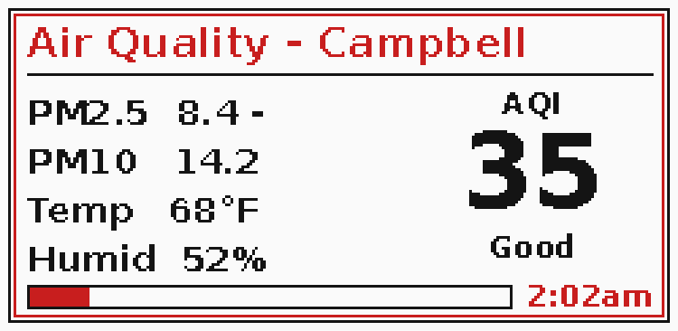

# Little Env Monitor

An air quality monitor for a Raspberry Pi Zero driving a [Waveshare 2.13" black/red e-ink display (V4)](https://www.waveshare.com/wiki/2.13inch_e-Paper_HAT_%28E%29_Manual).

Pulls PM2.5, PM10, temperature, and humidity from a [PurpleAir](https://www2.purpleair.com) sensor via the PurpleAir API, classifies the AQI, and renders it to the display every 30 minutes during the day (08:00–21:30). If the live fetch fails, the script falls back to the last cached reading (the full payload, with the header relabelled `[CACHED]`) so the panel keeps showing useful data through transient outages.



*Preview rendered with dummy data — regenerate with `python docs/generate_preview.py` after layout changes.*

## Hardware

- Raspberry Pi Zero (or any Pi with SPI)
- Waveshare 2.13" e-Paper HAT V4 — black **and red** ink (epd2in13b_V4)
- A PurpleAir outdoor sensor (any model with API access)

## Display layout

- **Header (red).** Shows one of three things, in priority order:
  - `"Air Quality [CACHED]"` — when the live fetch failed and the reading came from disk.
  - `"AQI Rising!"` — when PM2.5 has climbed by at least `TREND_THRESHOLD` µg/m³ since the previous reading.
  - The location label otherwise (`"Air Quality - <city>"`). The city comes from `[display] city` in `airquality.conf` and defaults to `Campbell`.
- **Body (black).** PM2.5 with a `+`/`-` trend marker, PM10, AQI category, temperature, and humidity.
- **AQI category (red)** when the category is "Unhealthy for Sensitive Groups" or worse (PM2.5 > 35.4 µg/m³); otherwise black.
- **Timestamp (red, bottom-right)** — the time of the last update.

## Rebuilding from scratch

```bash
git clone https://github.com/gkoch02/LittleEnvMonitor.git
cd LittleEnvMonitor
bash deploy.sh
```

The deploy script:

- installs system packages and creates a Python virtualenv at `.venv/`
- enables SPI via `raspi-config` (if available)
- prompts you to fill in `airquality.conf` and validates it
- creates the state directory `/var/lib/airquality/` for the cached reading
- renders the systemd unit using the current user, repo path, and venv Python, then enables the timer

It works regardless of what user you're running as (no hardcoded `pi`/`/home/pi`).

> **Note:** If SPI wasn't already enabled, you may need to reboot before the display responds.

## Configuration

`deploy.sh` will create `airquality.conf` from the example and prompt you to edit it. If you'd rather set it up by hand:

```bash
cp airquality.conf.example airquality.conf
nano airquality.conf
```

The file is a tiny INI:

```ini
[purpleair]
api_key = YOUR_PURPLEAIR_API_KEY
sensor_id = YOUR_SENSOR_ID
```

- **`api_key`** — request one at [api.purpleair.com](https://api.purpleair.com) (PurpleAir issues a read key and a write key; this script only needs the read key). Can also be set via the `PURPLEAIR_API_KEY` env var, which wins over the file. Use the env var path with `EnvironmentFile=` (mode 0600) when you'd rather not keep the secret in the repo dir.
- **`sensor_id`** — the integer that appears in the PurpleAir map URL when you click your sensor.

`airquality.conf` is gitignored, so your key won't be committed.

### Logging level

`LOG_LEVEL` (env var, default `INFO`) — set to `DEBUG` in a systemd drop-in to crank up verbosity without editing the script.

### Heartbeat / external monitoring

On each fully-successful run the script atomically writes a UTC ISO-8601 timestamp to `$AIRQUALITY_STATE_DIR/airquality/heartbeat`. It is **not** updated on the cache-fallback path, so an external monitor (a cron job, Healthchecks.io, etc.) can alert when the file goes stale — catching "silently stuck in cache fallback" failures that exit codes alone won't surface.

The timer only fires between 08:00 and 21:30, so the heartbeat will naturally go ~10.5 hours stale overnight. Tune your alert threshold to "stale during the day" (e.g. mtime > 60 min old AND local time is within the run window), or alert only after sunrise on the first miss.

## Schedule

Runs every 30 minutes between 08:00 and 21:30 via a systemd timer (no overnight refreshes). On each tick the script either renders a fresh reading or — if PurpleAir is unreachable — re-renders the last cached reading marked `[CACHED]`, so the display keeps showing useful data through transient outages.

To trigger a manual run and watch logs:

```bash
sudo systemctl start airquality.service
journalctl -u airquality.service -f
```

To check the timer:

```bash
systemctl status airquality.timer
systemctl list-timers airquality.timer
```

## Tests

The test suite covers the platform-independent code paths (AQI classification, config parsing, PurpleAir HTTP client with retry logic, and the JSON cache); the e-ink display path is excluded because it requires Pi hardware. Tests run on any machine — no `RPi.GPIO`/`spidev` needed.

```bash
python -m pip install -r requirements-dev.txt
python -m pytest
```

CI runs the same suite on every push and pull request across Python 3.10, 3.11, and 3.12 (see `.github/workflows/ci.yml`).

## Files

| File | Purpose |
|------|---------|
| `airQuality.py` | Main script — fetches data, classifies AQI, drives display |
| `airquality.conf.example` | Config template (copy to `airquality.conf` and fill in) |
| `deploy.sh` | One-shot deploy script for fresh Pi setup |
| `requirements.txt` | Runtime Python dependencies (includes Pi-only hardware libs) |
| `requirements-dev.txt` | Test dependencies (works on any machine) |
| `tests/` | Pytest suite for the platform-independent code paths |
| `.github/workflows/ci.yml` | CI workflow that runs `pytest` on push and pull request |
| `systemd/airquality.service.in` | systemd oneshot service unit template — rendered by `deploy.sh` |
| `systemd/airquality.timer` | systemd timer (every 30 min, 8 AM–9:30 PM) |
| `waveshare_epd/` | Waveshare e-Paper Python library (MIT, from [Waveshare's e-Paper repo](https://github.com/waveshare/e-Paper)). See `waveshare_epd/UPSTREAM.md` for vendored versions. |

## License

Project code: MIT. Waveshare library files in `waveshare_epd/` are copyright Waveshare, also MIT licensed.
